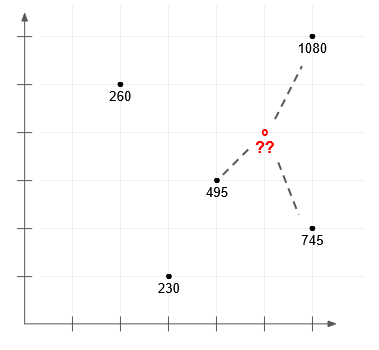

# k-nearest-neighbors-model---v1
Implementation of k-Nearest Neighbors algorithm for regression

The algorithm returns the predicted value for query, a single numeric value, or raises an appropriate exception (such as `ValueError`) when inappropriate inputs are passed.

### Example inputs and outputs
n_neighbors = 3

data = np.array([[3, 1, 230],
                 [6, 2, 745],
                 [6, 6, 1080],
                 [4, 3, 495],
                 [2, 5, 260]])

query = np.array([5, 4])

knn_regression(n_neighbors, data, query)  # returns 773.33

This is a visualization of the example inputs.

